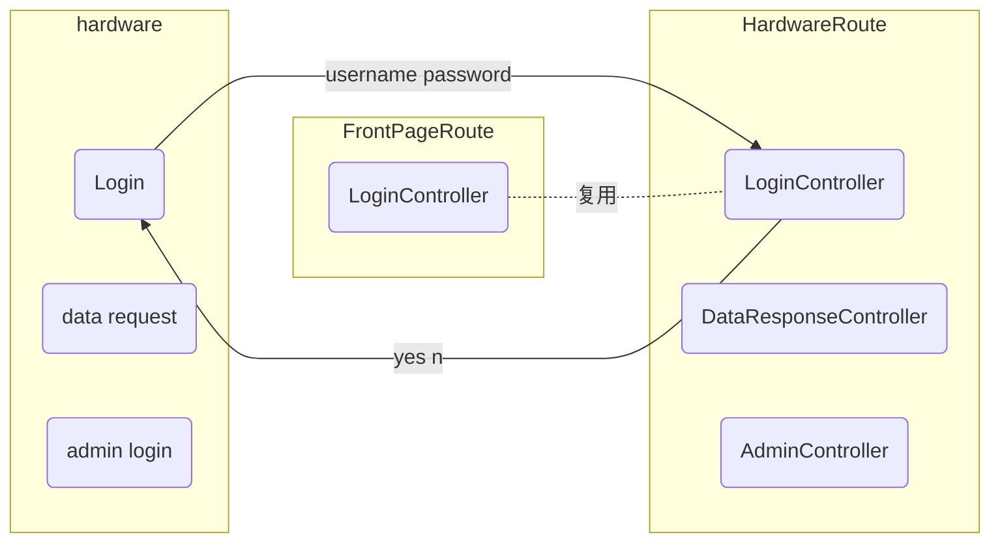

#
第四天

---
1. 块级元素可以自定高宽
1. 行内元素没有高宽 不会独占一行
1. 行内块级元素有高宽，不会独占一行
---

---

```mermaid
graph LR;
  subgraph hardware
      userLogNode(Login)
      hardwareResq(data request)
      adminLogNode(admin login)
  end
  subgraph HardwareRoute
      loginNode(LoginController)
      respNode(DataResponseController)
      adminNode(AdminController)

      userLogNode--username password-->loginNode
      loginNode--yes no-->userLogNode
  end

  subgraph FrontPageRoute
      frontLoginNode(LoginController)
      frontLoginNode-.复用.-loginNode
  end

```
